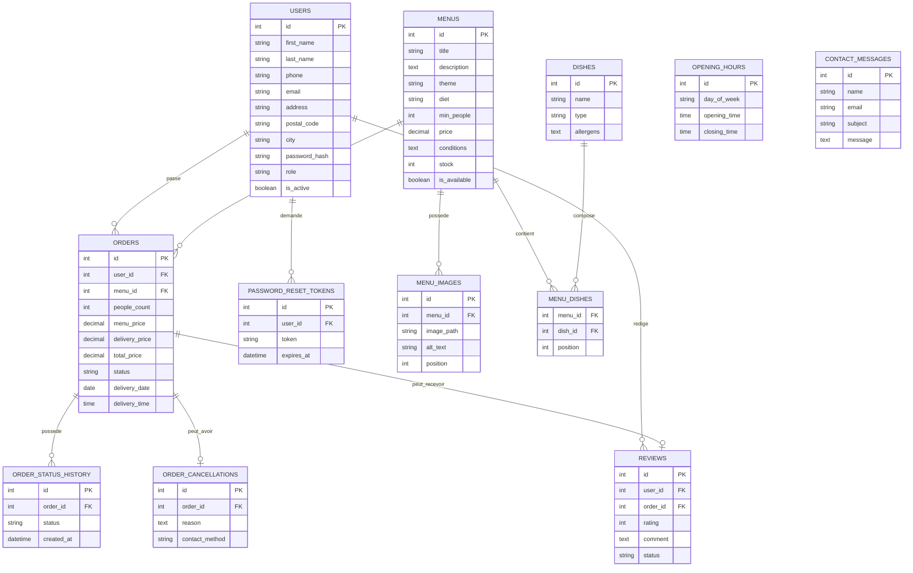
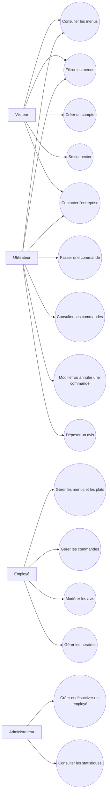
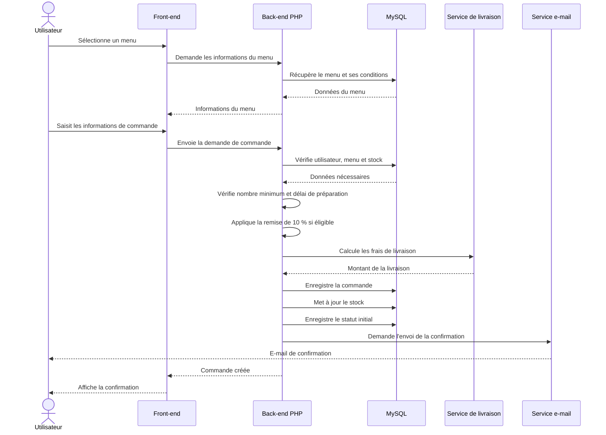

# Documentation technique - Vite & Gourmand

## 1. Présentation du projet

Vite & Gourmand est une application web de restauration et de service traiteur permettant aux visiteurs de consulter les menus proposés par l'entreprise et aux utilisateurs authentifiés de passer et suivre leurs commandes.

L'application distingue trois rôles principaux :

- **Utilisateur** : consultation des menus, commande, suivi et gestion des commandes, modification ou annulation lorsque cela est autorisé, et dépôt d'un avis après une commande terminée.
- **Employé** : gestion des menus, plats, allergènes, stocks et horaires, gestion et suivi des commandes clients, annulation d'une commande avec motif et moyen de contact, mise à jour des statuts et modération des avis.
- **Administrateur** : gestion des comptes employés et consultation des statistiques de commandes et de chiffre d'affaires.

Le projet utilise à la fois une base de données relationnelle MySQL pour les données métier et MongoDB pour les statistiques administratives.

## 2. Choix technologiques

### 2.1 Front-end

Le front-end est développé en **HTML5, CSS3 et JavaScript natif**.

Ce choix permet de maîtriser directement la structure des pages, leur mise en forme, leur comportement responsive et les interactions avec l'API PHP sans dépendre d'un framework front-end.

Le site possède notamment :

- une navigation responsive avec menu burger sur mobile ;
- des pages de consultation et de détail des menus ;
- des filtres dynamiques ;
- des formulaires d'inscription, de connexion, de contact et de commande ;
- des espaces dédiés aux utilisateurs, employés et administrateurs.

### 2.2 Back-end

Le back-end est développé en **PHP**.

Les différentes fonctionnalités sont organisées en routes et services. Les échanges entre le front-end et le back-end sont réalisés principalement à l'aide de requêtes HTTP depuis JavaScript.

**PDO** est utilisé pour communiquer avec MySQL et effectuer les requêtes SQL.

Le projet utilise également **Composer** pour gérer certaines dépendances PHP, notamment :

- **PHPMailer** pour l'envoi des e-mails ;
- **vlucas/phpdotenv** pour le chargement des variables d'environnement.

### 2.3 Base de données relationnelle

**MySQL** est utilisé comme base de données relationnelle principale.

Elle stocke notamment :

- les utilisateurs et leurs rôles ;
- les menus ;
- les plats ;
- les images des menus ;
- les associations entre menus et plats ;
- les commandes ;
- l'historique des statuts ;
- les annulations ;
- les avis clients ;
- les horaires d'ouverture ;
- les demandes de contact ;
- les jetons de réinitialisation de mot de passe.

Les relations entre ces données sont gérées à l'aide de clés primaires et de clés étrangères.

### 2.4 Base de données NoSQL

**MongoDB** est utilisé pour la partie NoSQL du projet.

Il est utilisé dans l'espace administrateur pour stocker et exploiter les statistiques liées aux menus et aux commandes. Les données statistiques peuvent ensuite être filtrées par période et affichées dans le tableau de bord administrateur.

L'application communique avec MongoDB grâce à l'extension PHP **mongodb**.

### 2.5 Envoi des e-mails

Les e-mails applicatifs sont envoyés avec **PHPMailer** en utilisant un serveur SMTP **Brevo**.

Ils sont notamment utilisés pour :

- la confirmation d'une commande ;
- la réinitialisation d'un mot de passe ;
- les demandes provenant du formulaire de contact ;
- la création d'un compte employé ;
- l'annulation d'une commande ;
- l'information concernant la restitution du matériel prêté.

Les identifiants SMTP ne sont pas enregistrés dans le dépôt Git et sont fournis à l'application par des variables d'environnement.

### 2.6 Calcul des frais de livraison

Le calcul des frais de livraison utilise **OpenRouteService**.

La livraison possède un tarif de base de **5 €**. Pour une livraison en dehors de Bordeaux, un supplément de **0,59 € par kilomètre** est calculé à partir de la distance routière.

La clé d'API est stockée dans la variable d'environnement `ORS_API_KEY` et n'est pas versionnée dans Git.

### 2.7 Déploiement

L'application est déployée avec **Railway**.

La base MySQL de production est également hébergée sur Railway. La base NoSQL est hébergée avec **MongoDB Atlas**.

Les informations sensibles et les paramètres propres à la production sont fournis à l'application à l'aide de variables d'environnement.

Le code source est versionné avec **Git** et hébergé sur **GitHub**.

## 3. Environnement de travail

Le développement de Vite & Gourmand a été réalisé dans un environnement local avant la mise en production.

### 3.1 Outils de développement

Les principaux outils utilisés sont :

- **Visual Studio Code** pour le développement ;
- **PHP** pour l'exécution du back-end ;
- **Composer** pour la gestion des dépendances PHP ;
- **MySQL** pour la base de données relationnelle ;
- **MongoDB** pour la base de données NoSQL ;
- **Git** pour le versionnement du code ;
- **GitHub** pour l'hébergement du dépôt distant ;
- **Figma** pour la réalisation des maquettes graphiques ;
- **GitHub Projects** pour le suivi et l'organisation du projet.

### 3.2 Serveur de développement

En environnement local, l'application peut être lancée depuis la racine du projet avec :

```bash
php -S localhost:8000

```

L'application est alors accessible à l'adresse :

```text
http://localhost:8000
```

### 3.3 Gestion des dépendances

Les dépendances PHP sont définies dans les fichiers `composer.json` et `composer.lock`.

Après récupération du projet, elles peuvent être installées avec :

```bash
composer install
```

Le projet déclare notamment l'extension PHP `mongodb`, nécessaire à la communication avec la base NoSQL.

### 3.4 Configuration de l'environnement

Les informations sensibles ne sont pas enregistrées directement dans le code source.

Le fichier `.env` contient les valeurs propres à l'environnement d'exécution, tandis que `.env.example` documente uniquement les variables nécessaires sans contenir les secrets.

Les principales variables utilisées sont :

- `DB_HOST`, `DB_PORT`, `DB_NAME`, `DB_USER`, `DB_PASSWORD` ;
- `SMTP_HOST`, `SMTP_PORT`, `SMTP_USERNAME`, `SMTP_PASSWORD`, `SMTP_FROM_EMAIL` ;
- `MONGODB_URI` ;
- `APP_URL` ;
- `ORS_API_KEY`.

Le fichier `.env` est exclu du dépôt Git afin de protéger les identifiants, mots de passe et clés d'API.

## 4. Modélisation

La modélisation de l'application permet de représenter les données métier, les interactions entre les différents utilisateurs et le déroulement des principales fonctionnalités.

### 4.1 Modèle conceptuel de données

La base relationnelle MySQL est organisée autour des principales entités suivantes :

- utilisateurs ;
- menus ;
- plats ;
- images des menus ;
- commandes ;
- historique des statuts ;
- annulations ;
- avis ;
- horaires d'ouverture ;
- demandes de contact ;
- jetons de réinitialisation de mot de passe.

La relation entre les menus et les plats est une relation plusieurs-à-plusieurs, matérialisée par la table d'association `menu_dishes`.

Le schéma détaillé du modèle de données est présenté dans le diagramme MCD associé à cette documentation.



### 4.2 Diagramme de cas d'utilisation

Le diagramme de cas d'utilisation présente les principales fonctionnalités accessibles selon le rôle de l'utilisateur.



Les droits d'accès sont contrôlés côté serveur afin de limiter chaque fonctionnalité aux rôles autorisés.

### 4.3 Diagramme de séquence — Passage d'une commande

Le diagramme suivant représente le déroulement principal d'une commande passée par un utilisateur authentifié.



Ce scénario illustre les contrôles effectués côté serveur avant l'enregistrement d'une commande. Le serveur reste responsable du calcul des prix, de la remise, des frais de livraison et de la validation des contraintes métier.

## 5. Sécurité

La sécurité de l'application est prise en compte à plusieurs niveaux afin de protéger les comptes utilisateurs, les données et les accès aux fonctionnalités réservées.

### 5.1 Mots de passe

Lors de l'inscription, le mot de passe doit respecter les règles définies par l'application : au minimum 10 caractères avec une majuscule, une minuscule, un chiffre et un caractère spécial.

Les mots de passe ne sont pas stockés en clair dans la base de données. Ils sont transformés à l'aide de `password_hash()` et vérifiés avec les fonctions sécurisées prévues par PHP.

La fonctionnalité de mot de passe oublié utilise un jeton temporaire permettant à l'utilisateur de définir un nouveau mot de passe.

### 5.2 Protection contre les injections SQL

Les accès à MySQL sont réalisés avec PDO et des requêtes préparées. Les données provenant des utilisateurs sont transmises séparément de la requête SQL afin de réduire les risques d'injection SQL.

### 5.3 Validation des données

Les données reçues par le back-end sont contrôlées avant leur utilisation.

Des validations métier sont notamment réalisées pour :

- le nombre minimum de personnes d'un menu ;
- l'application de la remise de 10 % ;
- les dates et horaires de livraison ;
- les délais de préparation ;
- la disponibilité et le stock des menus ;
- les droits permettant de modifier ou d'annuler une commande.

### 5.4 Gestion des rôles et des accès

L'application distingue les rôles `user`, `employee` et `admin`.

Les routes sensibles contrôlent la session et le rôle de l'utilisateur avant d'autoriser les opérations réservées.

Un compte employé peut également être désactivé par l'administrateur.

### 5.5 Protection des informations sensibles

Les identifiants de bases de données, identifiants SMTP et clés d'API sont stockés dans des variables d'environnement.

Le fichier `.env` est exclu du dépôt Git. Le fichier `.env.example` permet uniquement de documenter les variables nécessaires sans publier leurs valeurs.

### 5.6 Données personnelles

L'application ne collecte que les informations nécessaires au fonctionnement du service, notamment les coordonnées utilisées pour le compte utilisateur et les commandes.

Les données personnelles ne doivent pas être exposées publiquement dans le dépôt Git ou dans la documentation.

### 5.7 Accessibilité

Une attention est portée à l'accessibilité des interfaces : structure HTML sémantique, textes alternatifs pertinents pour les images de contenu, attributs ARIA lorsque nécessaires, navigation responsive et lisibilité des contenus.

Ces dispositions participent à la prise en compte du RGAA. Elles ne constituent pas à elles seules une certification de conformité complète.

## 6. Déploiement

L'application Vite & Gourmand est déployée sur Railway à partir du dépôt GitHub du projet.

### 6.1 Préparation du projet

Avant le déploiement :

- les dépendances PHP sont déclarées dans `composer.json` et verrouillées dans `composer.lock` ;
- l'extension PHP `mongodb` est déclarée comme dépendance de plateforme ;
- les secrets sont retirés du code source et placés dans des variables d'environnement ;
- `.env` est exclu du dépôt Git ;
- `.env.example` documente les variables nécessaires au fonctionnement de l'application.

### 6.2 Base de données MySQL

Une instance MySQL est utilisée sur Railway.

La structure et les données initiales sont installées dans l'ordre suivant :

1. `database/sql/01_creation_tables.sql`
2. `database/sql/02_insert_data.sql`

Le script de création définit les tables et leurs relations. Le second script insère les données nécessaires au démarrage de l'application, notamment les menus, plats, horaires et comptes de démonstration.

Les deux scripts ont été testés sur une base MySQL vierge avant la mise en production.

### 6.3 Base de données MongoDB

La base NoSQL de production est hébergée sur MongoDB Atlas.

L'application utilise la variable d'environnement `MONGODB_URI` pour établir la connexion.

MongoDB est utilisé pour les statistiques de l'espace administrateur. La collection nécessaire peut être alimentée par l'application lors du calcul et de l'enregistrement des statistiques.

### 6.4 Variables d'environnement

Les principales variables configurées pour la production sont :

- `DB_HOST`, `DB_PORT`, `DB_NAME`, `DB_USER`, `DB_PASSWORD` ;
- `SMTP_HOST`, `SMTP_PORT`, `SMTP_USERNAME`, `SMTP_PASSWORD`, `SMTP_FROM_EMAIL` ;
- `MONGODB_URI` ;
- `APP_URL` ;
- `ORS_API_KEY`.

Ces valeurs sont configurées directement dans l'environnement Railway et ne sont pas enregistrées dans le dépôt Git.

### 6.5 Services externes

Le déploiement utilise également :

- **Brevo** pour l'envoi des e-mails SMTP ;
- **OpenRouteService** pour le calcul des distances de livraison ;
- **MongoDB Atlas** pour la base NoSQL.

### 6.6 Mise en ligne

Railway est relié au dépôt GitHub du projet et la branche de production est `main`.

Une adresse HTTPS publique est générée par Railway pour rendre l'application accessible en ligne.

La variable `APP_URL` contient l'adresse publique de l'application et permet notamment de générer correctement les liens envoyés par e-mail.

### 6.7 Vérifications après déploiement

Après le déploiement final, un test fonctionnel doit être réalisé sur l'environnement de production afin de vérifier notamment :

- l'accès aux pages publiques ;
- l'inscription et la connexion ;
- la consultation et le filtrage des menus ;
- la création et le suivi d'une commande ;
- le calcul des frais de livraison ;
- l'envoi des e-mails ;
- les fonctionnalités employé et administrateur ;
- la connexion MySQL ;
- la connexion MongoDB et l'affichage des statistiques.

## 7. Conclusion technique

Le développement de Vite & Gourmand a permis de mettre en place une application web complète intégrant une interface responsive, une gestion des utilisateurs et des rôles, un système de commande, une gestion des menus et des plats, ainsi qu'un espace de gestion destiné aux employés et aux administrateurs.

L'architecture repose sur PHP pour le back-end, HTML/CSS/JavaScript pour le front-end, MySQL pour les données métier et MongoDB pour les statistiques. Des services externes sont également utilisés pour l'envoi des e-mails et le calcul des distances de livraison.

La séparation des informations sensibles dans les variables d'environnement permet de différencier la configuration locale de la configuration de production tout en évitant de publier les secrets dans le dépôt Git.

Le projet pourra évoluer avec de nouvelles fonctionnalités, notamment l'amélioration des statistiques, l'enrichissement des outils d'administration et l'amélioration continue de l'expérience utilisateur et de l'accessibilité.